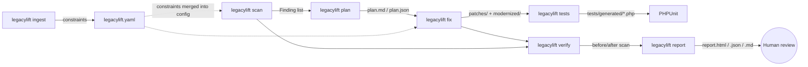

# Architecture



`legacylift run <path> --doc MIGRATION_NOTES.md` executes the whole chain
in order: **ingest → scan → plan → fix → tests → verify → report**, printing
a timed progress line per stage (see `docs/RESULTS.md` for a real run).

## Modules

| Module | Responsibility |
|---|---|
| `scanner/rules.py` | 14 independent detection rules (LL001–LL014): regex-based, line-oriented, each with a documented false-positive guard |
| `scanner/engine.py` | Walks the target tree (respecting `exclude_dirs`, symlink and file-size limits), runs every rule per file, aggregates findings, computes the risk score |
| `planner.py` | Groups findings by rule, orders security → compatibility → structure, classifies each as AUTO-FIXABLE / ASSISTED / MANUAL |
| `ingest.py` | Turns a free-text `MIGRATION_NOTES.md` into structured constraints merged into `legacylift.yaml` (see "Document understanding" below) |
| `fixer/fixes.py` | Atomic, per-rule rewrite functions — the only place that touches PHP source text |
| `fixer/engine.py` | Orchestrates the fix chain in a fixed order, writes unified diffs to `out/patches/`, optionally writes a full modernized copy to `out/modernized/` or edits in place |
| `fixer/templates.py` | The five generated PHP helpers (`db.php`, `escape.php`, `auth.php`, `csrf.php`, `env.php`) |
| `tests_gen.py` | Generates PHPUnit tests (SQLi regression, login/rehash, XSS-escaping, search) from the scan's findings |
| `verifier.py` | Re-scans `out/modernized/`, runs `php -l` when PHP is available (degrades gracefully otherwise), compares before/after, fails only if a **critical** finding that was marked **AUTO-FIXABLE** is still present |
| `report/` | Renders `report.json`, `report.md`, and a single self-contained `report.html` (inline CSS/JS, dark-mode aware, no CDN, filterable findings table) |

## Detection rule catalogue

| ID | Severity | Detects | Fixable? |
|---|---|---|---|
| LL001 | critical | Removed `mysql_*` functions | ✅ → PDO |
| LL002 | critical | SQL built by concatenating/interpolating request input | ✅ → parameterized query |
| LL003 | high | Unescaped output of user input (XSS) | ✅ → `e()` (htmlspecialchars) |
| LL004 | critical | Weak `md5`/`sha1` password hashing or plaintext compare | ✅ → `password_hash()`/`password_verify()`, guarded against rewriting a hash still used inside a SQL string |
| LL005 | high | Missing CSRF token on state-changing POST forms/handlers | ✅ → token field + verification |
| LL006 | high | `extract($_REQUEST)` / `$HTTP_*_VARS` (register_globals-style) | 🚩 ASSISTED — flagged with a TODO, not auto-rewritten |
| LL007 | medium | Deprecated/removed functions (`ereg*`, `split`, `create_function`, `magic_quotes`) | ✅ → modern equivalents |
| LL008 | medium | Short open tags, `@` suppression abuse, `error_reporting(0)` | ✅ short tags only; `@`/error_reporting left ASSISTED |
| LL009 | critical | `eval`, `exec`/`system`/`shell_exec`, dynamic include (LFI/RFI) | 🚩 ASSISTED — never auto-rewritten |
| LL010 | high | File upload with no extension/MIME/size validation | 🚩 ASSISTED — validation rules are a business decision |
| LL011 | high | Hard-coded credentials | ✅ → `.env` + `getenv()` |
| LL012 | low | Mixed HTML + business logic (file-level metric) | Detection only |
| LL013 | medium | Missing `session_regenerate_id()` on login | ✅ → inserted before session write |
| LL014 | low | Old-style constructors / missing visibility keywords | Detection only |
| LL015 | critical | `unserialize()` called directly on request input (`$_GET`/`$_POST`/`$_REQUEST`/`$_COOKIE`) — PHP object injection | 🚩 ASSISTED — requires human review; auto-fix would be `json_decode()` but the calling code's intent must be verified first |
| LL016 | high | `rand()`/`mt_rand()` used to generate a security-sensitive token (variable name contains `token`/`csrf`/`nonce`/`key`/`secret`, or written into `$_SESSION`) — not cryptographically secure | Detection only — replace with `bin2hex(random_bytes(N))` (PHP 7+) |

## Risk score formula

```
severity_weight = {critical: 40, high: 20, medium: 8, low: 3}   # legacylift.yaml
file_risk        = min(100, sum(severity_weight[finding.severity] for finding in file))
avg_file_risk    = mean(file_risk across all scanned files)
project_risk     = min(100, round(avg_file_risk * (1 + (scale_factor - 1) * 0.6)))
# scale_factor = 3.2 by default (legacylift.yaml: risk.scale_factor)
```

The `* (1 + (scale_factor - 1) * 0.6)` pull-up means a handful of severely
broken files still reads as high project risk even inside a large,
otherwise-clean tree — worked example against the real demo-app numbers in
`docs/RESULTS.md`: 20 files scanned, average file risk pulled from a raw
mean up to a **100/100** headline score before fixing (several files hit
the 100-point cap individually), then down to **14/100** after fixing.

## Manual-effort heuristic

```
manual_hours      = sum(hours_per_finding[severity] for finding in all findings)
legacylift_hours  = sum(0.02 for finding in all findings if finding.fixable)
# hours_per_finding: critical=1.5h, high=0.75h, medium=0.35h, low=0.15h (legacylift.yaml)
```

This is an explicitly honest *estimate*, not a measurement — the constants
live in `legacylift.yaml` so a team can recalibrate them against their own
historical fix times.

## Document understanding

`legacylift ingest <doc>` runs a small set of line-oriented patterns over
the migration-notes document (`ingest.py::parse_migration_notes`):
target PHP version (`php\s*(\d+\.\d+)`), "keep URLs unchanged", "do not
touch `<path>`" style sentences, a Bangla/UTF-8/Unicode mention, and a
"logins must keep working / no forced password reset" instruction (sets
`preserve_existing_logins: true`) — this last constraint is already
honored by the tool: `fixer/templates.py`'s generated `auth.php` includes
a `legacy_verify_password()` helper that transparently rehashes old
`md5`/`sha1` passwords on first successful login rather than invalidating
them, so existing users are never locked out during the upgrade. The
extracted constraints are merged into the project's `legacylift.yaml` under
`constraints:` and read by the fixer (`do_not_touch_paths` is checked
before any file is rewritten) and the demo (`examples/MIGRATION_NOTES.md`
→ `target_php_version: "8.2"`, `keep_urls_unchanged: true`,
`do_not_touch_paths: [...uploads...]`, `preserve_encoding: "UTF-8"`,
`preserve_existing_logins: true`).
This is intentionally a transparent rule-based extractor, not an LLM
call — no network access, fully offline, and every extraction is traceable
back to the sentence that produced it.
